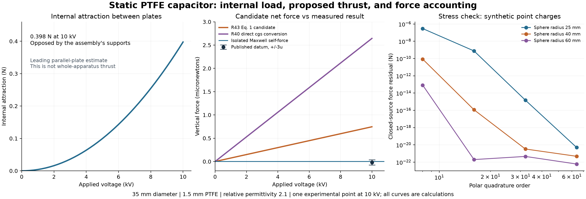

# First static-capacitor benchmark

**Result:** the chosen capacitor's ordinary internal attraction is about **0.398 N**, while the complete isolated apparatus has **zero steady Maxwell self-thrust**. The published candidate predicts **746 nN** at 10 kV. The reported vertical measurement, **−17.9 ± 18.8 nN**, is inconsistent with that full-amplitude prediction under the paper's stated three-uncertainty criterion. This is a test of a particular formula and configuration, not a resolution of EM–gravity unification.



**Material-history scope:** this benchmark assumes a reversible dielectric. It does not evaluate the user's hypothesis of PTFE electret buildup between runs or an asymmetric BaTiO₃ capacitor. The [retained-charge assessment](MATERIAL_HISTORY.md) documents the protocol gaps, relevant ceramic tests and requirements for the next model. Retention could affect a measurement protocol, but has not been shown to explain this null result.

## What was selected

The symmetric PTFE capacitor in **R43, Table 1**: 35 mm diameter, 1.5 mm thickness, relative permittivity 2.1, density 2,200 kg/m³, 10 kV. The data and source checksum are in [geometry.json](geometry.json). We use the **vertical** measurement only. The source is [Tajmar, Kößling & Neunzig, arXiv v2](https://arxiv.org/abs/2402.15640v2), preceding the [2024 journal article](https://doi.org/10.1038/s41598-024-70286-w); its Eq. 1 supplies the compared force law. No raw measurement data were reanalyzed.

PTFE permits a simple linear constitutive approximation. This calculation does not reproduce the exact epoxy, electrodes, leads, support compliance, shield geometry or laboratory environment. Those missing specifications prevent an apparatus-specific prediction of ordinary residual forces. They do not prevent a rigorous isolated-system self-force baseline or reproduction of the paper's stated candidate formula.

## Ordinary electromechanics

For plate area \(A\), gap \(d\), and \(\epsilon=\epsilon_0\epsilon_r\), the leading parallel-plate approximation gives

\[
C=\epsilon A/d,\quad E=V/d,\quad Q=CV,\quad U=CV^2/2.
\]

At fixed charge, the gap-closing force follows from \(-\partial_d[Q^2/(2C)]\). At fixed voltage the source exchanges energy, so use \(-\partial_d[U-QV]\), with \(U-QV=-CV^2/2\). Both give an attractive magnitude

\[
F_{\rm internal}=\frac{\epsilon A V^2}{2d^2}.
\]

This virtual displacement holds the material coefficient fixed. Actual solid-dielectric deformation also requires elasticity and electrostriction; the number is a characteristic clamping load, not a complete local stress prediction. Fringing is omitted: \(d/a=0.0857\), so it is not justified to claim sub-percent capacitance accuracy.

| Calculated quantity at 10 kV | Value |
|---|---:|
| Dielectric mass | 3.175 g |
| Capacitance | 11.93 pF |
| Internal field | 6.67 MV/m |
| Free charge magnitude per electrode | 119.3 nC |
| Bound charge magnitude per dielectric face | 62.47 nC |
| Stored field/polarization energy | 0.5963 mJ |
| Ideal compressive pressure | 413.2 Pa |
| Internal attractive force | 0.3975 N |

The bound charges have signs opposing the adjacent free electrode charge. During charging, \(\rho_b=-\nabla\cdot P\) and \(J_b=\partial_tP\) satisfy continuity including interface distributions. Electrode charge accumulation is supplied by the leads and return path. At equilibrium, ideal leakage is zero. No charge-nonconservation term is introduced.

### Force on the complete apparatus

Let \(Z\) translate **all** electrodes, dielectric, supports, battery, converter, leads and onboard enclosure together in otherwise empty space. Their mutual separations and the total static energy are independent of \(Z\), so

\[
F_Z=-\partial_Z U_{\rm total}=0.
\]

Plate forces and support reactions are internal. Equivalently, in surrounding vacuum,

\[
F_i=\oint_S\epsilon_0(E_iE_j-\tfrac12\delta_{ij}E^2)n_j\,dS.
\]

For the complete localized static source, this surface can be taken to infinity and the integral vanishes. During switching, field momentum, radiation and currents require the full electromagnetic balance; this benchmark concerns the settled electrostatic state.

This is a whole-system calculation by symmetry and conservation, **not a fabricated mesh result of exactly zero**. [stress.py](stress.py) separately verifies the surface method with exact point-charge fields. A surface enclosing one member of a charge pair recovers the nonzero Coulomb force. Enclosing an asymmetric complete charge set converges toward zero. An external uniform field gives the correct nonzero \(Q_{\rm total}E_{\rm ext}\). These checks prevent silently dropping external momentum transfer.

An external conductor changes the boundary problem. For a capacitor subsystem at fixed voltage,

\[
F_Z=\tfrac12V^2\partial_Z C_{\rm external}.
\]

A gradient of only \(1.49\times10^{-14}\;\mathrm{F/m}\) produces a 746 nN force at 10 kV. This is a sensitivity example, not evidence that this artifact occurred in the cited experiment. Including the external conductor within an isolated system restores the corresponding reaction force.

### Ordinary gravity and the battery

Importing the capacitor energy from outside would add a weight scale \(Ug_0/c^2=6.51\times10^{-20}\;\mathrm N\) in a uniform terrestrial field. An onboard battery instead loses the energy transferred to the capacitor and heat. If all energy remains within the weighed apparatus, there is no corresponding increase in total monopole mass; energy redistribution and gravitational gradients are separate, smaller issues. Neither case supplies a new directional self-thrust. This is energy bookkeeping, not a solved finite-geometry Einstein–Maxwell metric.

## The candidate and the measurement

Reproduce the experimental paper's Eq. 1 without adjustable enhancement:

\[
F_{43}(V)=\sqrt{G\epsilon_0\epsilon_r}\,\rho A V.
\]

For this geometry, \(F_{43}(10\,\mathrm{kV})=745.65\;\mathrm{nN}\), matching its rounded 746 nN entry. The signed voltage curve reverses with polarity; internal attraction and stored energy are even in voltage. The source has only one tabulated measurement point used here; our voltage curves are predictions, not measured sweeps.

Writing a diagnostic amplitude \(F=\lambda F_{43}\), the reported interval with multiplier three gives

\[
-0.09964\leq\lambda\leq0.05163.
\]

This is arithmetic using the paper's criterion, not a new confidence-level calculation. Either sign of the full-amplitude claim \(\lambda=\pm1\) lies outside it; if sign alignment is unspecified, the conservative absolute-amplitude bound is 0.09964. Material uncertainties and unmodeled systematics have not been independently estimated. The multiplier is a way of displaying the constraint, not a parameter fitted to rescue the theory.

### A normalization discrepancy worth preserving

[Ivanov's original R40](https://arxiv.org/abs/gr-qc/0502047), Eqs. 71–72, uses Gaussian cgs. Directly converting its weak-field expression \(g=\sqrt{G\epsilon_r}V/d\) to SI gives

\[
F_{40,\rm converted}=\sqrt{4\pi G\epsilon_0\epsilon_r}\,\rho AV
=\sqrt{4\pi}\,F_{43}.
\]

Independent conversion uses \(G_{\rm cgs}=1000G_{\rm SI}\), 1 statvolt ≈ 299.792458 V, centimeters and grams. The [NIST conversion guidance](https://www.nist.gov/pml/special-publication-811) and [CODATA values](https://physics.nist.gov/cuu/Constants/) fix the units. This yields **2.643 µN**, not 0.746 µN. We retain both named formulas instead of silently changing the experimental paper's convention. The stronger version is also outside the reported interval. This discrepancy needs explicit reconciliation before claiming a faithful full-theory implementation.

## The source/junction problem behind the proposed gravity

Our own diagnostic goes beyond substituting into the force law. For the weak-field, plane, \(k=0\) metric used by Ivanov, write \(g_{00}=e^{2u}\) and \(\Phi_g\simeq c^2u\). An approximately constant interior \(\partial_z\Phi_g=a\), joined to zero exterior gradient, has jumps in its normal derivative at both plates. Continuity of the metric value does not remove those jumps.

For the laboratory comparison this is the voltage-induced perturbation relative to the uncharged apparatus; ordinary material gravity and the Earth's background are not erased. Overall signs depend on orientation, but the two interface jumps have opposite signs.

Using the paper's junction equation (66), with \(\kappa=8\pi G/c^4\), the leading surface energy density requires

\[
\Sigma=\frac{S^0{}_0}{c^2}\simeq\frac{c^2}{4\pi G}[\partial_z u]
=\frac{[\partial_z\Phi_g]}{4\pi G}.
\]

The ideal two-interface construction therefore requires opposite-sign surface contributions. For the directly converted candidate, their magnitude is approximately **\(9.93\times10^5\;\mathrm{kg/m^2}\)**. Multiplication by the plate area gives a **955 kg scale at each interface**, one with the negative sign in this construction. These are diagnostic effective surface terms required by the assumed plane metric, not predictions that real electrodes weigh this much.

A bounded Maxwell stress-energy density can jump at a material boundary, but that alone is not a delta-function surface energy capable of supplying the required curvature jump. A physical material/field stress-energy model and junction solution must provide it. Finite edges and shielding require their own matching; constant potential on an electrode does not prove smooth gravitational matching.

Likewise, multiplying a vacuum electromagnetic stress tensor by a dielectric coefficient does not specify the material's complete relativistic stress-energy or constitutive action. The source audit must include that missing sector.

This exposes an unresolved step in applying the proposed metric to an ordinary neutral capacitor. It is not a general impossibility proof for every electromagnetic modification of gravity, nor a complete exact finite-capacitor solution. It is enough to prevent treating the candidate formula as an established consequence for this apparatus.

## Reproduce and interpret

From the repository root, with the existing NumPy environment:

```bash
.venv/bin/python -m unittest discover -s research/capacitor -p 'test_*.py' -v
.venv/bin/python research/capacitor/benchmark.py
```

To redraw the figure, run `plot_results.py` in an environment containing NumPy and Matplotlib. The calculation itself requires no plotting package. Exact SI outputs, signed voltage curves and quadrature refinement results are in [results.json](results.json); a scalable figure is [force_comparison.svg](force_comparison.svg).

Nine tests check virtual work, scaling, parity, the published rounded result, independent cgs conversion, signed bounds, nonzero Coulomb force, external force and whole-source cancellation. They verify this calculation's implementation, not a new physical theory. The next defensible calculation is an explicit material/source/junction model or an apparatus-specific conventional-force model with measured capacitance and geometry. The existing GPU gravity map is not needed to obtain this result.

The initial benchmark is tracked as ORC-j6i (completed). Source/junction completion is ORC-bsp; apparatus-specific residual-force modeling is ORC-rs0.
